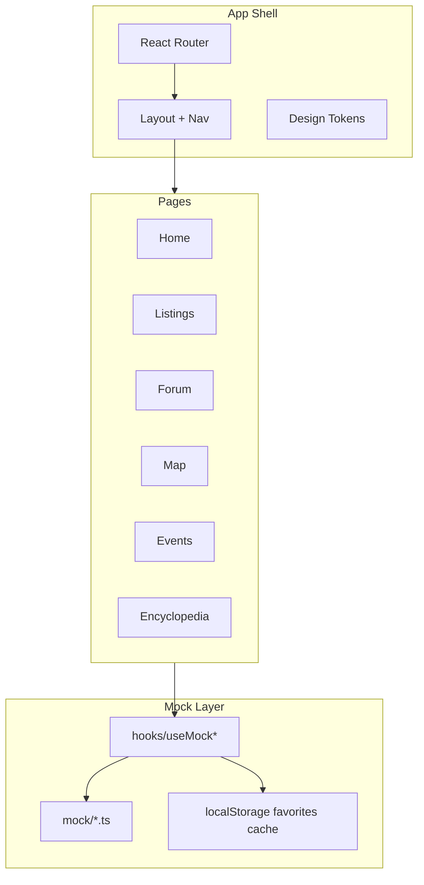

# План разработки La Moto (Frontend MVP)

## Контекст

Репозиторий содержит [`.cursor/rules/la-moto-spec.mdc`](../.cursor/rules/la-moto-spec.mdc). Реализуем **SPA без бэкенда**: все данные из локальных mock-файлов, интеграции — UI-заглушки.

**Целевой стек:**

- Vite + React 18 + TypeScript
- Tailwind CSS v4 (или v3 — по актуальной доке при scaffold)
- React Router v7
- Prettier (по правилам проекта)
- Leaflet — карта с mock-маркерами
- `@react-three/fiber` + `@react-three/drei` — интерактивная 3D-модель (упрощённая на MVP)

---

## Архитектура



**Структура папок:**

```
src/
  app/           # router, providers
  components/    # ui/, layout/, shared/
  pages/         # Home, Listings, Forum, Map, Events, Encyclopedia
  features/      # listings/, forum/, map/, events/, encyclopedia/, auth/
  mocks/         # data + типы
  hooks/
  lib/           # utils, constants
  styles/        # tailwind, globals
public/
  assets/        # images, 3d models (glb)
docs/
  DEVELOPMENT_PLAN.md
```

---

## Дизайн-система (из ТЗ)

| Токен          | Значение                                   |
| -------------- | ------------------------------------------ |
| `bg-primary`   | `#0a0a0a` (чёрный)                         |
| `bg-secondary` | `#2a2a2e` (стальной серый)                 |
| `accent`       | `#dc2626` (алый)                           |
| Шрифты         | Inter (base), Montserrat (заголовки)       |
| UI-паттерны    | glass-панели, gradient borders, hover glow |

Базовые UI-компоненты: `Button`, `Card`, `Input`, `Badge`, `Modal`, `Tabs`, `Select`, `Skeleton`.

---

## Этапы разработки

### Этап 0 — Инициализация проекта (1–2 дня)

- `npm create vite@latest . -- --template react-ts`
- Tailwind, React Router, ESLint, Prettier
- Базовый `Layout`: header с навигацией, footer
- Пустые route-заглушки для всех разделов
- README с командами `dev` / `build`

### Этап 1 — Mock-слой и типы (1 день)

TypeScript-интерфейсы и mock-данные: `Listing`, `ForumCategory`, `ForumThread`, `ForumPost`, `BikerOnMap`, `Event`, `EncyclopediaModel`, `User`.

### Этап 2 — Главная страница (2–3 дня)

Hero, категории, глобальный поиск, 3D-превью.

### Этап 3 — Объявления (3–4 дня)

Табы, фильтры, детальные страницы, premium-badge.

### Этап 4 — Мотоэнциклопедия (2 дня)

Каталог, фильтры, избранное, похожие объявления.

### Этап 5 — Мотособытия (2 дня)

Предстоящие/прошедшие, форма добавления.

### Этап 6 — Форум (3 дня)

Категории, темы, ответы, лайки.

### Этап 7 — Карта байкеров (2–3 дня)

Leaflet, mock-маркеры, online/offline.

### Этап 8 — 3D-модель запчастей (2–3 дня)

SVG-hotspots или GLB + R3F.

### Этап 9 — Auth и профиль (mock) (1–2 дня)

Modal авторизации, профиль, logout.

### Этап 10 — Полировка (2–3 дня)

Анимации, responsive, глобальный поиск, SEO, lazy routes.

---

## Ключевые технические решения

1. **Состояние:** React Context для auth + `useState`/`useReducer` в feature-модулях.
2. **Данные:** статические mocks; мутации — `localStorage`.
3. **Роутинг:** nested routes под Layout; lazy для Map и 3D.
4. **Карта:** Leaflet + OpenStreetMap.
5. **3D:** SVG-hotspots на MVP, опционально GLB + R3F.

---

## Definition of Done

- Тёмная тема, алый акcent
- Данные только из mock-слоя
- Адаптивность mobile + desktop
- Навигация между разделами работает
- Prettier применён

---

## Вне scope

- Backend API, БД, WebSocket
- Реальная OAuth, Stripe/WayForPay
- Парсинг OLX/AutoRia/Google Events
- React Native
- PWA offline cache
